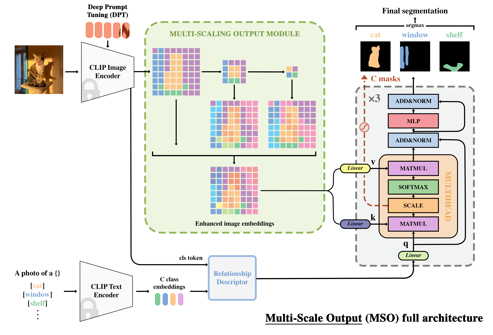
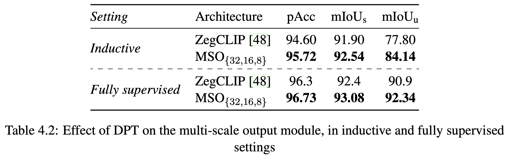

# Exploring Zero-Shot Capabilities of Multi-Modal Foundation Models for Semantic Image Segmentation

Dissertation for the MSc in Artificial Intelligence of the University of Surrey (2023/2024)

## Abstract

> Semantic image segmentation is particularly exciting as it requires models to approach a level of understanding of images equivalent to that of humans. As a foretaste of a potential general artificial intelligence — that is, an artificial intelligence model capable of performing or learning any cognitive task specific to humans — the so-called Foundation Models have recently pushed the limits of understanding the world around us. This dissertation explores the zero-shot capabilities of multimodal foundation models in the context of the semantic image segmentation task. This research work is based on the ZegCLIP architecture developed by Ziqin Zhou et al., a baseline that will be improved throughout this research work. Two key ideas were the main vectors of improvement: the integration of multi-scaling techniques to bridge the gap between the whole image scale (CLIP) and the pixel scale (segmentation) as well as the use of inner layers from the image encoder. This work contributes to the advancement of semantic segmentation techniques by identifying the limits of current approaches and proposing innovative architectures accordingly. The numerous experiments conducted have confirmed the relevance of the key points described above, greatly improving the segmentation performance of the ZegCLIP baseline, particularly its generalization capacity.

## My MSO Architecture

 

## Result Summary

 

